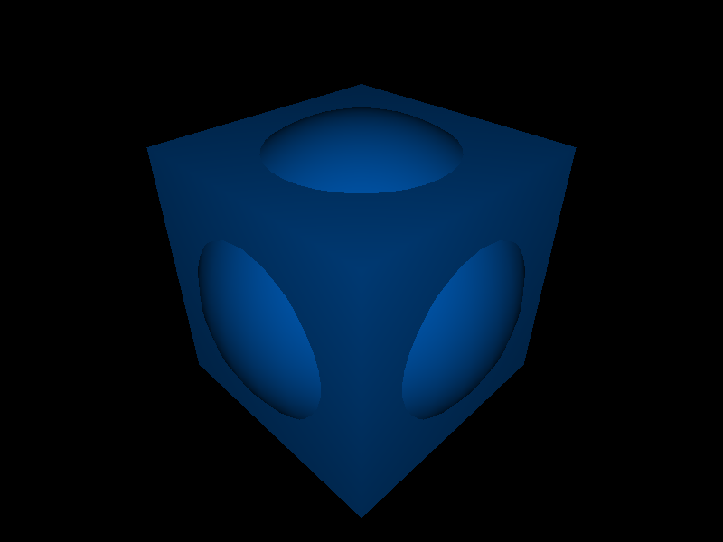

# Volumes

## Simple

### Cube

A cube is described by:

- center : Vector
- size : Vector.

```javascript
import { Cube, ZERO, ONE } from "solid";

let center = ZERO;
let size = ONE;

let cube = new Cube(center, size);
```


### Sphere

A sphere is described by:

- center : Vector
- radius : Number
- resolution : Integer  
  With `resolution` you can control the granularity of the approximation.

```javascript
import { Sphere, ZERO, ONE } from "solid";

let center = ZERO;
let radius = 1;
let resolution = 10;

let sphere = new Sphere(center, radius, resolution);
```


### Cylinder

A cylinder is described by:

- start : Vector
- end : Vector
- radius : Number
- resolution : Integer  
  With `resolution` you can control the granularity of the approximation.

```javascript
import { Cylinder, ZERO, ONE, UNIT_Y } from "solid";

let start = ZERO;
let end = UNIT_Y;
let radius = 1;
let resolution = 10;

let cylinder = new Cylinder(start, end, radius, resolution);
```


### Cone

A cone is described by:

- start : Vector
- end : Vector
- radiusStart : Number
- radiusEnd : Number
- closed : Boolean
- resolution : Integer  
  With `resolution` you can control the granularity of the approximation.

```javascript
import { Cone, ZERO, ONE, UNIT_Y } from "solid";

let start = ZERO;
let end = UNIT_Y;
let radiusStart = 1;
let radiusEnd = 0.2;
let resolution = 10;

let cone = new Cone(start, end, radiusStart, radiusEnd, resolution);
```


## Complex

### Lathe

Creates a rotational object:

- path : Path the path in the xy plane
- resolution : Integer the path resolution
- slices Integer the number of slices around the rotational axis

```javascript
import { Lathe, Path } from "solid";

let path = new Path()...;
let slices = 32;

let lathe = new Lathe(path, resolution, slices);
```


### Twist

Creates a rotational object:

- path : Path the path in the xz plane
- aspect : Number the amount of twist per height unit
- resolution : Integer the path resolution
- stacks Integer the number of stacks along the y-axis


### Path

Paths are building the base for many volumes. Paths are build in an abstract U-V-Space and translated according to the given axis.

The following image shows a simple path for creating a glas object.


A path is created using a flow builder pattern:

```javascript
let path = new Path()
  .moveTo(0, 0)
  .lineTo(10, 0)
  .lineTo(10, 2);
```

| Operation    | Description                       |
| ------------ | --------------------------------- |
| moveTo(u, v) | Must be the first item of a path. |
| lineTo(u, v) | Create a linear segment           |

TODO: arc and bezier paths

## Combine geometries

Combine two geometries by union, subtract and intersect.

```javascript
import { Cube, Sphere, ZERO, ONE } from "solid";
let cube = new Cube(ZERO, ONE);
let sphere = new Sphere(ZERO, 1.2, 32);

let union = cube.union(sphere);
let subtract = cube.subtract(sphere);
let intersect = cube.intersect(sphere);
```

| union               | subtract                  | intersect                   |
| ------------------- | ------------------------- | --------------------------- |
|  |  |  |
